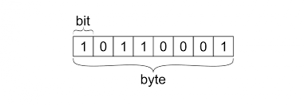
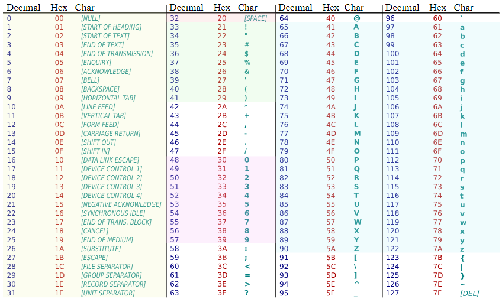
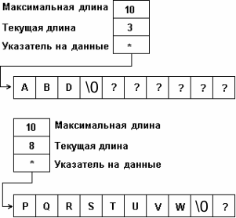

---

# УРОК 0:

---

##  Биты и байты

Что такое бит?

Бит — это минимальная единица информации в компьютере. Он может принимать значение 0 или 1.
8 бит составляют 1 байт.

## Что такое байт?

Байт — это единица информации, состоящая из 8 бит. Байт может представлять число от 0 до 255 (в десятичной системе) или от 0x00 до 0xFF (в шестнадцатеричной системе).
Байты используются для хранения символов, чисел и других данных.



## Простые типы в Golang

- **Простые типы**. Это целые числа, числа с плавающей запятой (числа с десятичной частью), булевы значения (true/false), строки (для текста) и другие.

| Тип       | Описание                                                                 | Примеры значений                          |
|-----------|-------------------------------------------------------------------------|------------------------------------------|
| `int`     | Целое число (размер зависит от архитектуры: 32 или 64 бита)               | `42`, `-10`                              |
| `int32`   | Целое число от −2 147 483 648 до 2 147 483 647 (32 бита)                   | `-100000`, `2147483647`                  |
| `int64`   | Целое число от −9 223 372 036 854 775 808 до 9 223 372 036 854 775 807 (64 бита) | `-5000000000`, `9223372036`              |
| `uint`    | Беззнаковое целое число (размер зависит от архитектуры: 32 или 64 бита)       | `0`, `42`                                |
| `float32` | Число с плавающей запятой одинарной точности (32 бита)                       | `3.14`, `-0.0001`                        |
| `float64` | Число с плавающей запятой двойной точности (64 бита)                       | `3.141592653589793`, `0.1`               |
| `bool`    | Логический тип, принимает значения `true` или `false`                          | `true`, `false`                          |
| `string`  | Строка текста                                                              | `"Hello, Go!"`, `""`                     |
| `byte`    | Синоним типа `uint8`, представляет байты                                     | `'a'`, `97`                              |
| `rune`    | Синоним типа `int32`, представляет символ в Unicode                          | `'ы'`, `0x0000044B`                      |

- **Составные типы**. Массивы, структуры и интерфейсы. Их мы рассмотрим позже.


---

##  Что такое UTF-8?

UTF-8 — это кодировка символов, которая может представлять любой символ Unicode, используя переменное количество байт. Она обратно совместима с ASCII, что означает, что любой текст в ASCII также является корректным UTF-8.

**Пример:**
- Символ `'A'` в ASCII — это `0x41` (65 в десятичной системе). В UTF-8 он также кодируется как `0x41`.

**Пример на Go:**
```go
package main

import (
	"fmt"
)

func main() {
	char := 'A'
	fmt.Printf("Символ: %c, Байты UTF-8: % x\n", char, []byte(string(char)))
}
```
Вывод:
```
Символ: A, Байты UTF-8: 41
```

---

## **ASCII: символы от 0 до 127**



### Что такое ASCII?
- **ASCII** (American Standard Code for Information Interchange) — это стандартная кодировка символов, которая использует 7 бит для представления символов.
- Она включает 128 символов, пронумерованных от `0` до `127`.
- Первые 32 символа (от `0` до `31`) — это управляющие символы (например, перевод строки, табуляция).
- Символы от `32` до `126` — это печатные символы (буквы, цифры, знаки препинания).
- Символ `127` — это управляющий символ DEL (удаление).

### Примеры:
- `65` — `'A'`
- `97` — `'a'`
- `48` — `'0'`

---

## Как UTF-8 кодирует символы?

UTF-8 использует переменное количество байт для кодирования символов. Количество байт зависит от кодовой точки Unicode символа. Вот как это работает:

- **1-байтовые символы**: Для кодовых точек `U+0000` до `U+007F` (диапазон ASCII).
- **2-байтовые символы**: Для кодовых точек `U+0080` до `U+07FF`.
- **3-байтовые символы**: Для кодовых точек `U+0800` до `U+FFFF`.
- **4-байтовые символы**: Для кодовых точек `U+10000` до `U+10FFFF`.

**Пример:**
- Символ `'é'` (U+00E9) кодируется как 2 байта: `0xC3 0xA9`.

**Пример на Go:**
```go
package main

import (
	"fmt"
)

func main() {
	char := 'é'
	fmt.Printf("Символ: %c, Байты UTF-8: % x\n", char, []byte(string(char)))
}
```
Вывод:
```
Символ: é, Байты UTF-8: c3 a9
```

---

## Как устроены байты в UTF-8?

UTF-8 использует определенный шаблон для кодирования байт:
- **Первый байт**: Указывает количество байт в последовательности.
  - `0xxxxxxx` для 1-байтовых символов.
  - `110xxxxx` для 2-байтовых символов.
  - `1110xxxx` для 3-байтовых символов.
  - `11110xxx` для 4-байтовых символов.
- **Продолжающие байты**: Начинаются с `10xxxxxx`.

**Пример:**
- Символ `'€'` (U+20AC) кодируется как 3 байта: `0xE2 0x82 0xAC`.
  - Первый байт: `11100010` (`0xE2`).
  - Продолжающие байты: `10000010` (`0x82`) и `10101100` (`0xAC`).

**Пример на Go:**
```go
package main

import (
	"fmt"
)

func main() {
	char := '€'
	fmt.Printf("Символ: %c, Байты UTF-8: % x\n", char, []byte(string(char)))
}
```
Вывод:
```
Символ: €, Байты UTF-8: e2 82 ac
```

---

## Как UTF-8 обрабатывает 4-байтовые символы?

Для символов вне базовой многоязыковой плоскости (BMP) UTF-8 использует 4 байта. Эти символы имеют кодовые точки от `U+10000` до `U+10FFFF`.

**Пример:**
- Эмодзи `'😊'` (U+1F60A) кодируется как 4 байта: `0xF0 0x9F 0x98 0x8A`.
  - Первый байт: `11110000` (`0xF0`).
  - Продолжающие байты: `10011111` (`0x9F`), `10011000` (`0x98`) и `10001010` (`0x8A`).

**Пример на Go:**
```go
package main

import (
	"fmt"
)

func main() {
	char := '😊'
	fmt.Printf("Символ: %c, Байты UTF-8: % x\n", char, []byte(string(char)))
}
```
Вывод:
```
Символ: 😊, Байты UTF-8: f0 9f 98 8a
```

---

## Как UTF-8 обеспечивает совместимость с ASCII?

UTF-8 разработана так, что любой корректный текст в ASCII также является корректным UTF-8. Это связано с тем, что символы ASCII (0x00 до 0x7F) кодируются одним байтом в UTF-8, и значения байт совпадают.

**Пример:**
- Строка `"Hello"` в ASCII совпадает с UTF-8: `0x48 0x65 0x6C 0x6C 0x6F`.

**Пример на Go:**
```go
package main

import (
	"fmt"
)

func main() {
	text := "Hello"
	fmt.Printf("Текст: %s, Байты UTF-8: % x\n", text, []byte(text))
}
```
Вывод:
```
Текст: Hello, Байты UTF-8: 48 65 6c 6c 6f
```

---

## Как декодировать байты UTF-8 обратно в символы?

Чтобы декодировать байты UTF-8 в символы, мы можем просто преобразовать их в строку.

**Пример:**
- Байты `[]byte{0xE2, 0x82, 0xAC}` представляют символ `'€'`.

**Пример на Go:**
```go
package main

import (
	"fmt"
)

func main() {
	bytes := []byte{0xE2, 0x82, 0xAC}
	char := string(bytes)
	fmt.Printf("Байты: % x, Декодированный символ: %s\n", bytes, char)
}
```
Вывод:
```
Байты: e2 82 ac, Декодированный символ: €
```

---

## Что происходит, если байты UTF-8 некорректны?

Если байты не являются корректными UTF-8, Go не вызовет ошибку, но символы могут отображаться некорректно.

**Пример:**
- Последовательность байт `[]byte{0xFF}` некорректна в UTF-8.

**Пример на Go:**
```go
package main

import (
	"fmt"
)

func main() {
	invalidBytes := []byte{0xFF}
	char := string(invalidBytes)
	fmt.Printf("Некорректные байты: % x, Декодированный символ: %s\n", invalidBytes, char)
}
```
Вывод:
```
Некорректные байты: ff, Декодированный символ: �
```

---

## Как визуализировать кодировку UTF-8?

Давай разберем кодировку символа в байты UTF-8.

**Пример:**
- Символ `'é'` (U+00E9) кодируется как 2 байта: `0xC3 0xA9`.

**Пример на Go:**
```go
package main

import (
	"fmt"
)

func main() {
	char := 'é'
	utf8Bytes := []byte(string(char))
	fmt.Printf("Символ: %c\n", char)
	fmt.Printf("Кодовая точка Unicode: U+%04X\n", char)
	fmt.Printf("Байты UTF-8: % x\n", utf8Bytes)
}
```
Вывод:
```
Символ: é
Кодовая точка Unicode: U+00E9
Байты UTF-8: c3 a9
```

---

Конечно! Давайте разберем всё по порядку: ASCII, битые символы в UTF-8, а также формат кодовых точек Unicode.

---


## **Битый символ в UTF-8 (�)**

### Что это такое?
- Символ `�` (ромб с вопросом) — это **замещающий символ** (replacement character), который отображается, когда программа не может корректно декодировать байты в UTF-8.
- Его кодовая точка в Unicode — **`U+FFFD`**.

### Когда он возникает?
1. **Некорректные байты**:
   - Если байты не соответствуют правилам UTF-8 (например, продолжающий байт без начального).
   - Пример: байт `0xFF` не является корректным UTF-8.

2. **Неполная последовательность**:
   - Если последовательность байт обрывается (например, не хватает продолжающих байт).

3. **Неподдерживаемые символы**:
   - Если символ не может быть отображен из-за ограничений шрифта или системы.

### Пример на Go:
```go
package main

import (
	"fmt"
)

func main() {
	// Некорректные байты
	invalidBytes := []byte{0xFF}
	str := string(invalidBytes)
	fmt.Println(str) // Выведет: �
}
```

---

## **Формат кодовых точек Unicode: U+XXXX**

### Что такое кодовая точка?
- **Кодовая точка** — это числовое значение, которое представляет конкретный символ в стандарте Unicode.
- Например, символ `'A'` имеет кодовую точку `U+0041`.

### Почему 4 числа через тире?
- Формат `U+XXXX` используется для обозначения кодовых точек Unicode.
- `U+` — это префикс, который указывает, что это кодовая точка Unicode.
- `XXXX` — это 4 шестнадцатеричных цифры, которые представляют значение кодовой точки.

### Почему именно 4 цифры?
- Unicode определяет кодовые точки в диапазоне от `U+0000` до `U+10FFFF`.
- Для представления этого диапазона достаточно 4 шестнадцатеричных цифр:
  - Минимальное значение: `U+0000` (0).
  - Максимальное значение: `U+10FFFF` (1,114,111 в десятичной системе).

### Примеры:
- `U+0041` — `'A'`
- `U+00E9` — `'é'`
- `U+1F60A` — `'😊'`

---

## **Почему UTF-8 имеет такую "странную" кодировку?**

UTF-8 использует переменное количество байт для кодирования символов. Это связано с несколькими причинами:

###  **Совместимость с ASCII**
- UTF-8 полностью совместим с ASCII. Все символы ASCII (от `0` до `127`) кодируются одним байтом, и их значения совпадают.
- Это позволяет использовать UTF-8 в системах, которые изначально работали с ASCII.

### **Эффективность**
- UTF-8 использует минимальное количество байт для кодирования символов:
  - 1 байт для ASCII.
  - 2 байта для большинства европейских символов.
  - 3 байта для большинства азиатских символов.
  - 4 байта для редких символов и эмодзи.

### **Однозначность**
- Старшие биты первого байта указывают количество байт в последовательности:
  - `0xxxxxxx` — 1 байт.
  - `110xxxxx` — 2 байта.
  - `1110xxxx` — 3 байта.
  - `11110xxx` — 4 байта.
- Продолжающие байты всегда начинаются с `10xxxxxx`, что позволяет легко отличать их от начальных байт.

### . **Гибкость**
- UTF-8 может представлять все символы Unicode, включая редкие символы и эмодзи.

---

## **Пример кодировки UTF-8**

### Пример 1: Символ `'A'` (U+0041)
- Кодовая точка: `U+0041`.
- В UTF-8: `0x41` (1 байт).

### Пример 2: Символ `'é'` (U+00E9)
- Кодовая точка: `U+00E9`.
- В UTF-8: `0xC3 0xA9` (2 байта).

### Пример 3: Символ `'😊'` (U+1F60A)
- Кодовая точка: `U+1F60A`.
- В UTF-8: `0xF0 0x9F 0x98 0x8A` (4 байта).

---

### Еще есть utf-16 и utf-32

utf-16 представляет все элементы в виде 2 или 4 байт, utf-32 представляет все элементы в виде 4 байт.


## Строки

Теперь поговорим про строки в go (обзорно). 

Конечно! Давайте разберем, как устроены строки в Go, как они хранятся в памяти, и какие операции с ними можно выполнять.

---

## **Что такое строка в Go?**

Строка в Go — это **неизменяемая последовательность байт**, которая представляет текст в кодировке UTF-8. Строки в Go являются **значениями** (value types), а не ссылочными типами.

### Пример:
```go
s := "Hello, Go!"
```

---

## **Как строки хранятся в памяти?**

Строка в Go состоит из двух частей:
1. **Указатель на массив байт** (адрес начала строки в памяти).
2. **Длина строки** (количество байт).

### Внутреннее представление:

```go
type string struct {
    ptr *byte // Указатель на массив байт
    len int   // Длина строки в байтах
}
```

### Пример:

Для строки `"Hello"`:
- Указатель будет указывать на массив байт: `[72, 101, 108, 108, 111]`.
- Длина строки: `5` (байт).

---

### Почему так?

Вернемся к деду Go, его предку - языку Си. Строка там выглядела так:



В C:

Строка — это массив символов (char[]), который заканчивается нулевым байтом (\0).
Например, строка "Hello" в C выглядит так: ['H', 'e', 'l', 'l', 'o', '\0'].
Длина строки не хранится явно, поэтому для определения длины нужно пройтись по всей строке до символа \0.


В Go:

Строка — это структура, которая содержит указатель на массив байт и длину строки.
Нулевой байт (\0) не используется для обозначения конца строки.
Длина строки хранится явно, поэтому нет необходимости искать конец строки.


## **Строки и UTF-8**

Хотя строки в Go хранятся как последовательность байт, они обычно содержат текст в кодировке UTF-8. Это означает, что символы могут занимать от 1 до 4 байт.

### Пример:
```go
s := "Привет"
fmt.Println(len(s)) // Вывод: 12 (так как каждый кириллический символ занимает 2 байта)
```

---

## **Операции со строками**

### **Конкатенация строк**
Для объединения строк используется оператор `+`. Это называется конкатенация строк (объединение)

```go
s1 := "Hello"
s2 := "Go"
result := s1 + ", " + s2
fmt.Println(result) // Вывод: Hello, Go
```

### **Длина строки**
Функция `len()` возвращает длину строки в байтах, а не в символах.

```go
s := "Привет"
fmt.Println(len(s)) // Вывод: 12 (байт)
```

Чтобы получить количество символов (рун), нужно преобразовать строку в срез рун:
```go
s := "Привет"
fmt.Println(len([]rune(s))) // Вывод: 6 (символов)
```

### **Доступ к символам**
Строки в Go поддерживают индексацию, но она возвращает байты, а не символы.

```go
s := "Привет"
fmt.Println(s[0]) // Вывод будет числом 208 (первый байт символа 'П')
```
Как хранится строка "Привет" в памяти?

Строка "Привет" состоит из 6 символов, но в кодировке UTF-8 каждый кириллический символ занимает 2 байта. Поэтому строка "Привет" в памяти выглядит как последовательность байт:

```go
П  р  и  в  е  т
208 159 209 128 208 184 208 178 208 181 209 130
'П' — 208 159
'р' — 209 128
'и' — 208 184
'в' — 208 178
'е' — 208 181
'т' — 209 130
```

Чтобы получить символы, нужно преобразовать строку в срез рун:
```go
s := "Привет"
runes := []rune(s)
fmt.Println(string(runes[0])) // Вывод: П
```

### **Срезы строк**
Срезы строк возвращают подстроку, но работают на уровне байт, а не символов.

```go
s := "Привет"
sub := s[0:2] // Берет первые 2 байта
fmt.Println(sub) // Вывод: П (часть символа, может быть некорректной)
```

Для корректной работы с символами используйте срезы рун:
```go
s := "Привет"
runes := []rune(s)
sub := string(runes[0:3]) // Берет первые 3 символа
fmt.Println(sub) // Вывод: При
```

### **Сравнение строк**
Строки можно сравнивать с помощью операторов `==`, `!=`, `<`, `>`, `<=`, `>=`.

```go
s1 := "Hello"
s2 := "Hello"
fmt.Println(s1 == s2) // Вывод: true
```

### **Поиск подстроки**
Для поиска подстроки используется функция `strings.Contains()`.

```go
package main

import (
	"fmt"
	"strings"
)

func main() {
	s := "Hello, Go!"
	fmt.Println(strings.Contains(s, "Go")) // Вывод: true
}
```

### **Разделение строки**
Для разделения строки на части используется функция `strings.Split()`.

```go
package main

import (
	"fmt"
	"strings"
)

func main() {
	s := "Hello,Go,World"
	parts := strings.Split(s, ",")
	fmt.Println(parts) // Вывод: [Hello Go World] преобразуется в слайс!
}
```

### **Замена подстроки**
Для замены подстроки используется функция `strings.Replace()`.

```go
package main

import (
	"fmt"
	"strings"
)

func main() {
	s := "Hello, Go!"
	newS := strings.Replace(s, "Go", "World", 1)
	fmt.Println(newS) // Вывод: Hello, World!
}
```

### **Преобразование строки в верхний/нижний регистр**
Для этого используются функции `strings.ToUpper()` и `strings.ToLower()`.

```go
package main

import (
	"fmt"
	"strings"
)

func main() {
	s := "Hello, Go!"
	fmt.Println(strings.ToUpper(s)) // Вывод: HELLO, GO!
	fmt.Println(strings.ToLower(s)) // Вывод: hello, go!
}
```

---

## **Неизменяемость строк**

Строки в Go **неизменяемы**. Это означает, что после создания строки её содержимое нельзя изменить. Любая операция, которая "изменяет" строку, на самом деле создает новую строку.

### Пример:
```go
s := "Hello"
s[0] = 'h' // Ошибка: нельзя изменить строку
```

---

## **Эффективность работы со строками**

- **Конкатенация** с использованием `+` может быть неэффективной для большого количества операций, так как каждый раз создается новая строка. В таких случаях лучше использовать `strings.Builder`.

```go
package main

import (
	"fmt"
	"strings"
)

func main() {
	var builder strings.Builder
	builder.WriteString("Hello")
	builder.WriteString(", ")
	builder.WriteString("Go!")
	result := builder.String()
	fmt.Println(result) // Вывод: Hello, Go!
}
```

---

## Пакет strconv

Пакет strconv в Go предоставляет функции для преобразования строк в числа и обратно.

### 1. Функция Itoa

Функция Itoa преобразует целое число (int) в строку.

Синтаксис:
```go
func Itoa(i int) string
```

Пример:

```go
package main

import (
	"fmt"
	"strconv"
)

func main() {
	num := 42
	str := strconv.Itoa(num)
	fmt.Println(str) // Вывод: "42"
	fmt.Printf("Тип: %T\n", str) // Вывод: Тип: string
}

```

### 2. Функция Atoi

Функция Atoi преобразует строку в целое число (int). Если строка не может быть преобразована в число, возвращается ошибка.

Синтаксис:

```go
func Atoi(s string) (int, error)
```

```go
package main

import (
	"fmt"
	"strconv"
)

func main() {
	str := "123"
	num, err := strconv.Atoi(str)
	if err != nil {
		fmt.Println("Ошибка:", err)
	} else {
		fmt.Println(num) // Вывод: 123
		fmt.Printf("Тип: %T\n", num) // Вывод: Тип: int
	}
}
```

### 3. Функция ParseInt

Функция ParseInt преобразует строку в целое число с указанием системы счисления (base) и размера числа (bitSize).

Синтаксис:

```go
func ParseInt(s string, base int, bitSize int) (int64, error)
```

Параметры:

- **s**: строка, которую нужно преобразовать.
- **base**: система счисления (например, 10 для десятичной, 16 для шестнадцатеричной).
- **bitSize**: размер числа в битах (например, 32 для int32, 64 для int64).

Пример:

```go
package main

import (
	"fmt"
	"strconv"
)

func main() {
	str := "1010" // Двоичное число
	num, err := strconv.ParseInt(str, 2, 64) // base=2 (двоичная система), bitSize=64
	if err != nil {
		fmt.Println("Ошибка:", err)
	} else {
		fmt.Println(num) // Вывод: 10 (десятичное представление)
		fmt.Printf("Тип: %T\n", num) // Вывод: Тип: int64
	}
}
```

Параметр bitSize определяет размер числа в битах. Например:

- bitSize=8 — число будет преобразовано в int8.
- bitSize=16 — число будет преобразовано в int16.
- bitSize=32 — число будет преобразовано в int32.
- bitSize=64 — число будет преобразовано в int64.

**Параметр bitSize в функциях пакета strconv может принимать только стандартные значения: 8, 16, 32, 64.**

Значения bitSize=1 или bitSize=5 недопустимы, так как Go не поддерживает типы данных с такими размерами.

Если указать недопустимое значение, это вызовет ошибку.

## Ввод пользователя


**Функция fmt.Scanf**

Функция fmt.Scanf считывает ввод пользователя и сохраняет его в переменные, используя форматирование, аналогичное fmt.Printf.

```go
func Scanf(format string, a ...interface{}) (n int, err error)
```

- format: Строка формата, которая указывает, как интерпретировать ввод.
- a ...interface{}: Указатели на переменные, куда будут сохранены данные.
- **Возвращает**:
  ○ n: Количество успешно считанных значений.
  ○ err: Ошибка, если что-то пошло не так.

  ###  Примеры использования

  Пример 1: Считывание одного числа

  ```go

  package main

    import "fmt"

    func main() {
        var age int
        fmt.Print("Введите ваш возраст: ")
        _, err := fmt.Scanf("%d", &age)
        if err != nil {
            fmt.Println("Ошибка:", err)
        } else {
            fmt.Printf("Ваш возраст: %d\n", age)
        }
    }

  ```   

- %d — формат для целого числа.
- &age — указатель на переменную age, куда будет сохранено значение.

Пример 2: Считывание нескольких значений

```go
package main

import "fmt"

func main() {
    var name string
    var age int
    fmt.Print("Введите ваше имя и возраст: ")
    _, err := fmt.Scanf("%s %d", &name, &age)
    if err != nil {
        fmt.Println("Ошибка:", err)
    } else {
        fmt.Printf("Имя: %s, Возраст: %d\n", name, age)
    }
}

```

Пример 3: Считывание строки с пробелами

Если нужно считать строку с пробелами, используйте fmt.Scanln или bufio.Scanner(о нем ниже).

```go
package main

import "fmt"

func main() {
    var name string
    fmt.Print("Введите ваше имя: ")
    fmt.Scanln(&name)
    fmt.Printf("Ваше имя: %s\n", name)
}

```

- fmt.Scanln считывает строку до символа новой строки (\n).

Использование bufio.Scanner:

```go

package main

import (
    "bufio"
    "fmt"
    "os"
)

func main() {
    scanner := bufio.NewScanner(os.Stdin)
    fmt.Print("Введите ваше имя: ")
    scanner.Scan()
    name := scanner.Text()
    fmt.Printf("Ваше имя: %s\n", name)
}

```

- bufio.Scanner считывает всю строку, включая пробелы.

## Форматы для fmt.Scanf (а также Sprintf, Println, но об этом позже)

## Таблица популярных форматтеров

| Спецификатор | Описание                                                                 | Пример входных данных | Пример переменной   | Результат       |
|--------------|-------------------------------------------------------------------------|-----------------------|---------------------|-----------------|
| `%d`         | Число в десятичной системе                                               | `123`                 | `var x int`         | `x = 123`       |
| `%f`         | Число с плавающей точкой (дробное)                                       | `123.45`              | `var y float64`     | `y = 123.45`    |
| `%s`         | Строка (до пробела или конца строки)                                     | `hello`               | `var s string`      | `s = "hello"`   |
| `%c`         | Один символ                                                             | `A`                   | `var c rune`        | `c = 'A'`       |
| `%x`         | Число в шестнадцатеричной системе                                        | `7F`                  | `var x int`         | `x = 127`       |
| `%o`         | Число в восьмеричной системе                                             | `77`                  | `var x int`         | `x = 63`        |
| `%t`         | Логическое значение                                                     | `true`                | `var b bool`        | `b = true`      |
| `%3s`        | Строка длиной не более трёх символов (ограничение ширины ввода)          | `abcde`               | `var prefix string` | `prefix = "abc"`|
| `%3d`        | Число, ограниченное тремя символами (например, `001` → `1`)             | `1234`                | `var x int`         | `x = 123`       |
| `%v`         | Значение, соответствующее типу переменной (универсальный формат)        | `42`                  | `var x int`         | `x = 42`        |
| `\n`         | Пропускает символ новой строки (используется для разделения)            | —                     | —                   | —               |
| `%%`         | Литерал `%` в формате                                                   | `%`                   | —                   | `%`             |

**примечание**

- %3s и %3d — это спецификаторы с ограничением ширины. Они обрезают ввод до указанного количества символов.
- \n — используется для пропуска символа новой строки, например, при чтении файлов или ввода.
- %% — используется для вывода символа % в форматированной строке.

## Давай решим несколько задачек и проверим насколько тебе понятен материал 

### Задача 1: Сумма двух чисел

Напиши программу, которая считывает два целых числа с помощью fmt.Scanf и выводит их сумму.

Подсказка: чтобы присвоить значение переменной x, нужно в аргументе функции Scanf взять адрес от x с помощью &. Это выглядит так: **fmt.Scanf("%d", &x)**

### Задача 2: Преобразование строки в число

Напиши программу, которая считывает строку с помощью fmt.Scanln, преобразует её в число с помощью strconv.Atoi и выводит это число.

### Задача 3:  Преобразование строки в число (без ввода пользователя)

Напиши программу, которая преобразует строку "42" в целое число с помощью strconv.Atoi и выводит результат.

### Задача 4: Преобразование двоичной строки в число

Напиши программу, которая преобразует двоичную строку "1010" в целое число с помощью strconv.ParseInt и выводит результат.

### Задача 5: Преобразование шестнадцатеричной строки в число

Напиши программу, которая преобразует шестнадцатеричную строку "FF" в целое число с помощью strconv.ParseInt и выводит результат.

## Руны


### Что такое руна?

- Руна в Go — это синоним для типа int32.
- Она используется для представления одного символа Unicode.
- Каждая руна соответствует кодовой точке Unicode, которая может быть представлена числом от 0 до 0x10FFFF (1,114,111 в десятичной системе).

### Зачем нужны руны?

В Go строки представляют собой последовательности байт, обычно в кодировке UTF-8.
Однако символы Unicode могут занимать от 1 до 4 байт в UTF-8.
Руны позволяют работать с символами как с отдельными единицами, независимо от того, сколько байт они занимают.

### Руна (rune) — это псевдоним для int32

В Go rune действительно является псевдонимом (alias) для типа int32. Это означает, что с точки зрения памяти и представления данных они идентичны. Например:

``` go
    var r rune = 'A'
    var i int32 = 'A'
    fmt.Println(r == i) // Вывод: true
```

### Зачем тогда нужен тип rune?

**Семантическое значение**

- Тип rune добавляет семантический смысл кода. Когда вы видите rune, вы сразу понимаете, что это значение представляет собой символ Unicode, а не просто произвольное 32-битное число.
- Это делает код более читаемым и понятным.

```go
    var r rune = 'A' // Понятно, что это символ
    var i int32 = 65  // Неочевидно, что это символ 'A' 
```
**Удобство работы с Unicode**

- Руны напрямую связаны с кодовыми точками Unicode. Это делает их удобными для работы с текстом, особенно когда символы занимают несколько байт в UTF-8.
- Использование rune подчеркивает, что вы работаете с символами, а не с произвольными числами.

```go
s := "Привет"
for _, r := range s { // r имеет тип rune
    fmt.Printf("%c ", r) // Вывод: П р и в е т
}
```

**Безопасность и ясность**

- Использование rune помогает избежать ошибок, связанных с неправильной интерпретацией чисел как символов.
- Например, если вы используете int32, другой разработчик может не понять, что число 65 представляет символ 'A'. С rune это очевидно.

**Совместимость с функциями и библиотеками**

- Многие функции в стандартной библиотеке Go (например, utf8.DecodeRune, strings.Reader.ReadRune) работают с типом rune. Использование rune делает код более согласованным и удобным для интеграции с этими функциями.

### Можно ли использовать int32 вместо rune?

Технически да, но это не рекомендуется по следующим причинам:

1. Потеря семантики: Код станет менее читаемым и понятным.
2. Ошибки: Легко спутать числа и символы, что может привести к ошибкам.
3. Совместимость: Некоторые функции и библиотеки ожидают тип rune, и использование int32 может потребовать явного приведения типов. 

**Пример использования int32 вместо rune**

```go
var i int32 = 65 // Это символ 'A', но это неочевидно
fmt.Printf("%c\n", i) // Вывод: A
```

Сравни с использованием rune:

```go
var r rune = 'A' // Понятно, что это символ
fmt.Printf("%c\n", r) // Вывод: A
```

### Как объявить руну?

Руну можно объявить как символ в одинарных кавычках:

```go
r := 'A' // Руна, представляющая символ 'A'
```

Или как числовое значение:

```go
r := rune(65) // Руна, представляющая символ 'A' (кодовая точка 65)
```

**Давай разберем, что будет хранить переменная r в каждом из этих случаев.**

```go
r := rune(65)
fmt.Printf("Значение: %d, Символ: %c\n", r, r)

//Здесь 65 — это числовое значение, представляющее кодовую точку Unicode.
//В Unicode кодовая точка 65 соответствует символу 'A'.
//Тип rune — это псевдоним для int32, поэтому r будет хранить число 65, но интерпретироваться как символ.
```

Вывод: Значение: 65, Символ: A

Теперь r := 'A'

```go
r := 'A'
fmt.Printf("Значение: %d, Символ: %c\n", r, r)
```

Вывод: Значение: 65, Символ: A

Оба выражения r := rune(65) и r := 'A' создают переменную r типа rune, которая хранит число 65.

Разница лишь в том, как ты задаешь значение:
- В первом случае вы явно указываешь числовое значение (65).
- Во втором случае вы используете символьный литерал ('A'), который автоматически преобразуется в числовое значение.

### Руны и строки

- Строка в Go — это последовательность байт, но её можно преобразовать в срез рун, чтобы работать с отдельными символами.
- Преобразование строки в срез рун:

```go
s := "Привет"
runes := []rune(s) // Преобразуем строку в срез рун
fmt.Println(runes) // Вывод: [1055 1088 1080 1074 1077 1090]
```

Обратное преобразование (срез рун в строку):

```go
runes := []rune{'П', 'р', 'и', 'в', 'е', 'т'}
s := string(runes) // Преобразуем срез рун в строку
fmt.Println(s) // Вывод: Привет
```

### Руны и Unicode

Каждая руна соответствует кодовой точке Unicode. Например:

- 'A' — U+0041 (65 в десятичной системе).
- 'П' — U+041F (1055 в десятичной системе).
- '😊' — U+1F60A (128522 в десятичной системе).

Пример:

```go
r := '😊'
fmt.Printf("Руна: %c, Кодовая точка: %U\n", r, r)
```

Вывод:

Руна: 😊, Кодовая точка: U+1F60A

### Итерация по строке с использованием рун

Если хочешь перебрать символы строки, а не байты, используй цикл for с рунами:

```go
s := "Привет"
for _, r := range s {
    fmt.Printf("%c ", r) // Вывод: П р и в е т
}

``` 
в этом коде руны используются посредством спецификатора %c в функции fmt.Printf. 

### Руны и длина строки

Функция len() возвращает длину строки в байтах, а не в символах. Чтобы получить количество символов, преобразуй строку в срез рун:


```go

s := "Привет"
fmt.Println(len(s))         // Вывод: 12 (байт)
fmt.Println(len([]rune(s))) // Вывод: 6 (символов)

```

### Руны и срезы

Срезы строк работают на уровне байт, а не символов. Чтобы корректно работать с символами, используй срезы рун:

```go

s := "Привет"
runes := []rune(s) //слайс рун
sub := string(runes[0:3]) // Берем первые 3 символа
fmt.Println(sub)          // Вывод: При

```

### Руны и преобразование типов

Руны можно преобразовывать в другие типы, например, в int32, int, string:

```go
r := 'A'
fmt.Println(int(r))  // Вывод: 65 (кодовая точка)
fmt.Println(string(r)) // Вывод: A
```

## Циклы

### Базовый цикл for

Самый простой способ использования цикла for — это классический цикл с условием.

Синтаксис:

```go
for инициализация; условие; пост-действие {
    // Тело цикла
}
```

Пример:

```go
package main

import "fmt"

func main() {
    for i := 0; i < 5; i++ {
        fmt.Println(i)
    }
}
```

Вывод:

```go
0
1
2
3
4
```

### Цикл for как while

В Go нет отдельного ключевого слова while. Вместо этого используется for с одним условием.

Синтаксис:

```go
for условие {
    // Тело цикла
}
```

Пример:

```go
package main

import "fmt"

func main() {
    i := 0
    for i < 5 {
        fmt.Println(i)
        i++
    }
}
```


Вывод:

```go
0
1
2
3
4
```

**Бесконечный цикл**

Если опустить условие, цикл for будет выполняться бесконечно. Чтобы выйти из такого цикла, используй break.

Синтаксис:

```go
for {
    // Тело цикла
}
```

Пример:

```go
package main

import "fmt"

func main() {
    i := 0
    for {
        if i >= 5 {
            break
        }
        fmt.Println(i)
        i++
    }
}
```

```
0
1
2
3
4
```

### Цикл for с range

Цикл for с range используется для итерации по элементам массивов, срезов, строк, карт и каналов.

Синтаксис: 

```go
for индекс, значение := range коллекция {
    // Тело цикла
}
```


Пример итерации по срезу(slice/слайс):

```go
package main

import "fmt"

func main() {
    nums := []int{10, 20, 30}
    for i, num := range nums {
        fmt.Printf("Индекс: %d, Значение: %d\n", i, num)
    }
}
```

Вывод:

```go
Индекс: 0, Значение: 10
Индекс: 1, Значение: 20
Индекс: 2, Значение: 30
```

Итерация по строке (рунам):

```go
package main

import "fmt"

func main() {
    s := "Привет"
    for i, r := range s {
        fmt.Printf("Индекс: %d, Символ: %c\n", i, r)
    }
}
```

Вывод:

```go
Индекс: 0, Символ: П
Индекс: 2, Символ: р
Индекс: 4, Символ: и
Индекс: 6, Символ: в
Индекс: 8, Символ: е
Индекс: 10, Символ: т
```

**Пропуск индекса или значения**

Если тебе не нужен индекс или значение, используйте _ (пустой идентификатор/заглушка в простонародье).

Пример:

```go
package main

import "fmt"

func main() {
    nums := []int{10, 20, 30}
    for _, num := range nums {
        fmt.Println(num)
    }
}
```

Вывод:

```go
10
20
30
```

### Управление циклом: break и continue

- break — завершает выполнение цикла.
- continue — пропускает текущую итерацию и переходит к следующей.

Пример:

```go
package main

import "fmt"

func main() {
    for i := 0; i < 10; i++ {
        if i == 5 {
            break // Выход из цикла
        }
        if i%2 == 0 {
            continue // Пропуск четных чисел
        }
        fmt.Println(i)
    }
}
```


## Давай теперь закрепим то, что прошли и решим парочку задачек

### Задача 6

Напиши программу, которая подсчитывает количество символов (рун) в строке "Привет, мир!" и выводит результат.

Подсказка: помни, что строка хранит unicode символы в байтах, чтобы можно было считать кол-во юникод элементов (например количество русских букв "р", то нужно явно преобразовать строку в срез рун!)


## Что ты узнала: 


- UTF-8 — это кодировка переменной длины, которая представляет символы Unicode с использованием 1–4 байт.
- Она обратно совместима с ASCII.
- Первый байт последовательности UTF-8 указывает количество байт, а продолжающие байты начинаются с `10`.
- Go предоставляет удобные способы работы с UTF-8 через преобразование строк и байт.

- **ASCII** использует 7 бит и кодирует символы от `0` до `127`.
- **Битый символ `�`** (U+FFFD) появляется, когда UTF-8 не может декодировать байты.
- **Кодовые точки Unicode** записываются в формате `U+XXXX`, где `XXXX` — 4 шестнадцатеричных цифры.
- **UTF-8** использует переменное количество байт для эффективного кодирования символов, сохраняя совместимость с ASCII.

- Строки в Go — это неизменяемые последовательности байт, обычно в кодировке UTF-8.
- Они хранятся как указатель на массив байт и длина.
- Основные операции: конкатенация, получение длины, доступ к символам, срезы, сравнение, поиск, замена и преобразование регистра.
- Для эффективной работы с большими строками используйте `strings.Builder`.
- strconv — это мощный инструмент для работы с числами и строками.
- Используй Itoa, Atoi, ParseInt для преобразований строки в число.
- Ввод пользователя:
- Для считывания ввода используйте функции fmt.Scanf, fmt.Scanln и bufio.Scanner.
- fmt.Scanf позволяет считывать данные с форматированием.
- fmt.Scanln считывает строку до символа новой строки.
- bufio.Scanner удобен для считывания многострочного ввода.
- Руна — это тип int32, используемый для представления одного символа Unicode.
- Руны позволяют корректно работать с символами, которые занимают несколько байт в UTF-8.
- Строки можно преобразовывать в срезы рун для работы с отдельными символами.
- Руны поддерживают Unicode, что делает их удобными для работы с текстом на разных языках.
- В Go есть только один вид цикла — for, но он может использоваться в разных формах:
- Классический for: с инициализацией, условием и пост-действием.
- for как while: с одним условием.
- Бесконечный for: без условия.
- for с range: для итерации по коллекциям (строкам, срезам, картам и каналам).
- Управление циклом: break (выход из цикла) и continue (пропуск текущей итерации).

---

