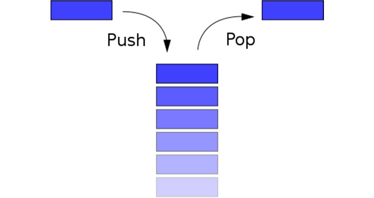

# map в Go и немного про Stack

## 1. Введение в map

- Map (ассоциативный массив) - это коллекция пар "ключ-значение", где каждый ключ уникален. В Go map реализован как хеш-таблица.

Аналогия из жизни

Представь словарь:

- Ключ - слово
- Значение - определение слова

Выглядит примерно так: ```{"ключ" : значение}```


**Создание map**

Объявление:

```var m map[string]int  // nil-мапа (нельзя использовать до инициализации)```

Инициализация:

```go
// Способ 1
m1 := make(map[string]int)

// Способ 2
m2 := map[string]int{
    "apple":  5,
    "banana": 3,
}
```

Пример:

```go
package main

import "fmt"

func main() {
    // Инициализация
    prices := map[string]float64{
        "apple":  1.25,
        "banana": 0.99,
        "orange": 1.49,
    }

    // Добавление элемента
    prices["pear"] = 1.49

    // Получение значения
    fmt.Println("Цена яблока:", prices["apple"])

    // Проверка наличия ключа
    if price, exists := prices["mango"]; exists {
        fmt.Println("Цена манго:", price)
    } else {
        fmt.Println("Манго нет в ассортименте")
    }

    // Удаление элемента
    delete(prices, "banana")
    fmt.Println("После удаления банана:", prices)
}

```

## 2. Основные операции

Добавление/изменение

```go
m := map[string]int{
    "apple":  5,
    "banana": 3,
}

m["orange"] = 2  // Добавляем новую пару
m["apple"] = 7    // Изменяем существующее значение
```

Получение значения:

```go
count := m["apple"]  // Если ключа нет - вернёт нулевое значение типа
```

Проверка существования ключа:

```go
value, exists := m["banana"]
if exists {
    fmt.Println("Banana count:", value)
}
```

Удаление:

```go
delete(m, "orange")
```

Длина map:

```go
size := len(m)
```


## Стек (Stack)



Что такое стек?

- Стек — это структура данных, работающая по принципу "последним пришёл — первым вышел" (LIFO - Last In, First Out). Представьте стопку тарелок: вы кладёте тарелки одну на другую и берёте всегда сверху.

**Основные операции со стеком**

В стеке есть две ключевые операции:

- Push (положить) - добавление элемента на вершину стека
- Pop (взять) - удаление элемента с вершины стека

Реализация стека в Go:

```go
package main

import "fmt"

func main() {
    var stack []int // Создаём пустой стек

    // Добавляем элементы (Push)
    stack = append(stack, 10)
    stack = append(stack, 20)
    stack = append(stack, 30)
    
    fmt.Println("Стек после добавления:", stack) // [10 20 30]

    // Удаляем элементы (Pop)
    top := stack[len(stack)-1] // Получаем верхний элемент
    stack = stack[:len(stack)-1] // Удаляем его
    fmt.Println("Взяли элемент:", top) // 30
    fmt.Println("Стек после удаления:", stack) // [10 20]
}
```

Где используют стеки?

- Отмена действий (Undo) - каждое действие сохраняется в стек
- История браузера - переход назад/вперёд по страницам
- Вызов функций - стек вызовов в программировании
- Парсеры и вычисления - обработка математических выражений
- Алгоритмы - обход графов, решение задач

**Практический пример стэка: проверка скобок**

```go
func isBalanced(expr string) bool {
    stack := []rune{}
    pairs := map[rune]rune{
        ')': '(',
        '}': '{',
        ']': '[',
    }
    
    for _, char := range expr {
        switch char {
        case '(', '{', '[':
            stack = append(stack, char) // Push
        case ')', '}', ']':
            if len(stack) == 0 || stack[len(stack)-1] != pairs[char] {
                return false
            }
            stack = stack[:len(stack)-1] // Pop
        }
    }
    
    return len(stack) == 0
}

// Использование:
fmt.Println(isBalanced("({[]})")) // true
fmt.Println(isBalanced("({[}"))   // false
```

### Основные ошибки со стэком:

- Pop из пустого стека - всегда проверяйте размер перед извлечением
- Использование индексов - работайте только с верхним элементом
- Не забывайте уменьшать размер - после Pop не забывайте обрезать срез

### Задача stack: "Обратный порядок слов"

Условие:

Создайте программу, которая принимает строку из нескольких слов
Используйте стек, чтобы переставить слова в обратном порядке
Выведите результат

Подсказка: Разбей готовую строку (например ```input := "кошка собака хомяк попугай"```) с помощью ```strings.Fields(input)``` - из пакета "strings", этот метод возвращает слайс (slice) строк


### Попрактикуемся по тому, что уже знаем 

**Задача 1**

Напишите программу, которая подсчитывает, сколько раз каждый символ встречается в строке.

```go
text := "abracadabra"
```

Подсказка:

- Используй map[rune]int для хранения результатов
- Итерируй по строке с помощью for _, char := range text
- Учитывайте, что строка - это последовательность рун

**Задача 2**

Найди общие элементы двух слайсов.

```go
slice1 := []int{1, 2, 3, 4}
slice2 := []int{3, 4, 5, 6}
```

Подсказка:

- Сначала создайте map из элементов первого слайса
- Затем проверьте, какие элементы второго слайса есть в этой map

**Задача 3**

 Группировка слов по длине
 Сгруппируй слова из слайса по их длине.

```go
words := []string{"cat", "dog", "elephant", "lion", "mouse"}
```

Подсказка:

- Используйте map[int][]string где ключ - длина слова
- При добавлении слова проверяйте, есть ли уже такой ключ в map


**Задача 4**

Поиск первого неповторяющегося символа

Найдите первый символ в строке, который не повторяется.

```go
text := "stress"
```

Подсказка:

- Сначала подсчитайте частоту всех символов
- Затем пройдите по строке еще раз и найдите первый символ с частотой 1

**Задача 5**

Инвертирование map
Инвертируйте map (ключи становятся значениями).

```go
original := map[string]int{"a": 1, "b": 2, "c": 3}
```

**Задача 6**
Поиск дубликатов чисел
Условие: Найдите все числа, которые повторяются в списке более одного раза.

Входные данные:

```go
numbers := []int{1, 2, 2, 3, 4, 4, 5}
```

Вывод:

```go
map[2:true 4:true]
```


**Задача 7**

Группировка имен по возрасту
Условие: Сгруппируйте имена людей по их возрасту.

Входные данные:
```go
people := map[string]int{"Alice": 25, "Bob": 30, "Charlie": 25}
```

Вывод:

```go
map[25:[Alice Charlie] 30:[Bob]]
```

**Задача 8**
Поиск отсутствующих чисел

Условие: Найдите числа из полного диапазона, которых нет в заданном списке.

Входные данные:
```go
allNumbers := []int{1, 2, 3, 4, 5}
input := []int{2, 3, 5}
```

Ожидаемый вывод:
```go
map[1:true 4:true]
```

**Задача 9**
Объединение двух словарей

Условие: Объедините два словаря. При совпадении ключей оставьте значение из второго словаря.

Входные данные:

```go
map1 := map[string]int{"a": 1, "b": 2}
map2 := map[string]int{"b": 3, "c": 4}
```

Вывод:

```go
map[a:1 b:3 c:4]
```

